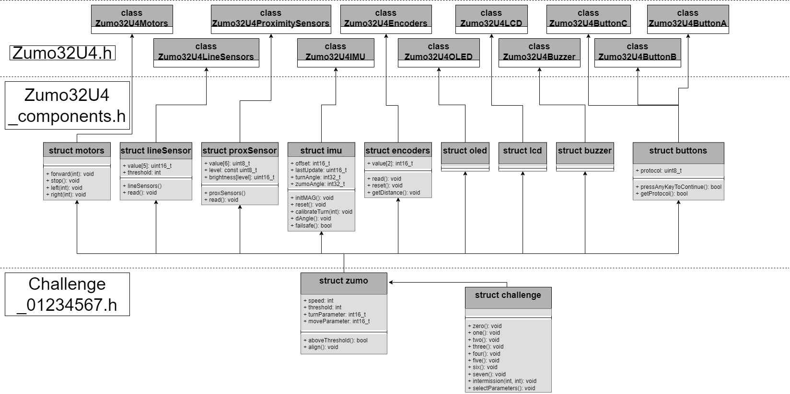

# AAU Miniproject "Robot programmering"
### ROB1 176 
| **STUDY NR**       | **FULL NAME**                   | **EMAIL**                 |
| ------------------ | ------------------------------- | ------------------------- |
| `000000000`        | Filip Lukasz Kulik              |  fkulik23@student.aau.dk  |
| `000000000`        | Gustav Schubert Faldt Pedersen  |  gsfp23@student.aau.dk    |
| `000000000`        | Jonas Mølgaard Strøm Hansen     |  jmsh23@student.aau.dk    |
| `202333351`        | Mathias Lykholt - Ustrup        |  mustru23@student.aau.dk  |
| `000000000`        | Simon Toftgaard Garner          |  sgarne23@student.aau.dk  |
| `000000000`        | William Dalsgaard Christensen   |  wchris21@student.aau.dk  |

# Challenge_0
Using object-oriented programming (OOP), the solution to Challenge_0 is split into 5 files:
+ 1x Arduino file ( .ino )
+ 2x Header files ( .h )
+ 2x C++ files ( .cpp )

## Class UML diagram

